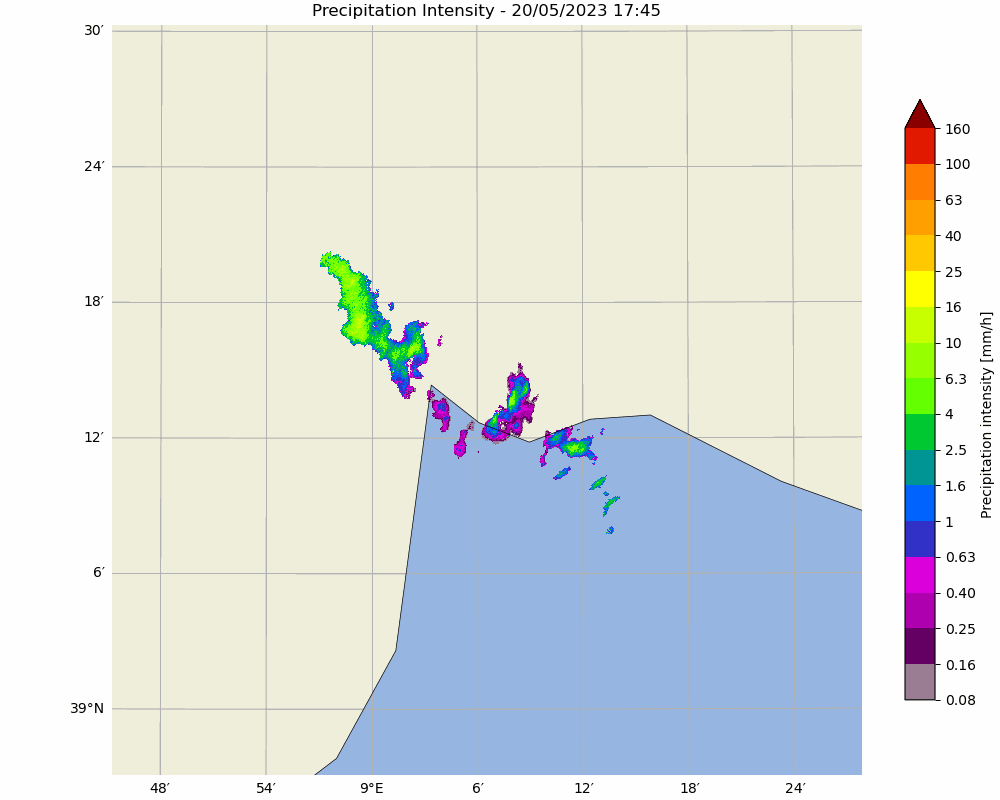
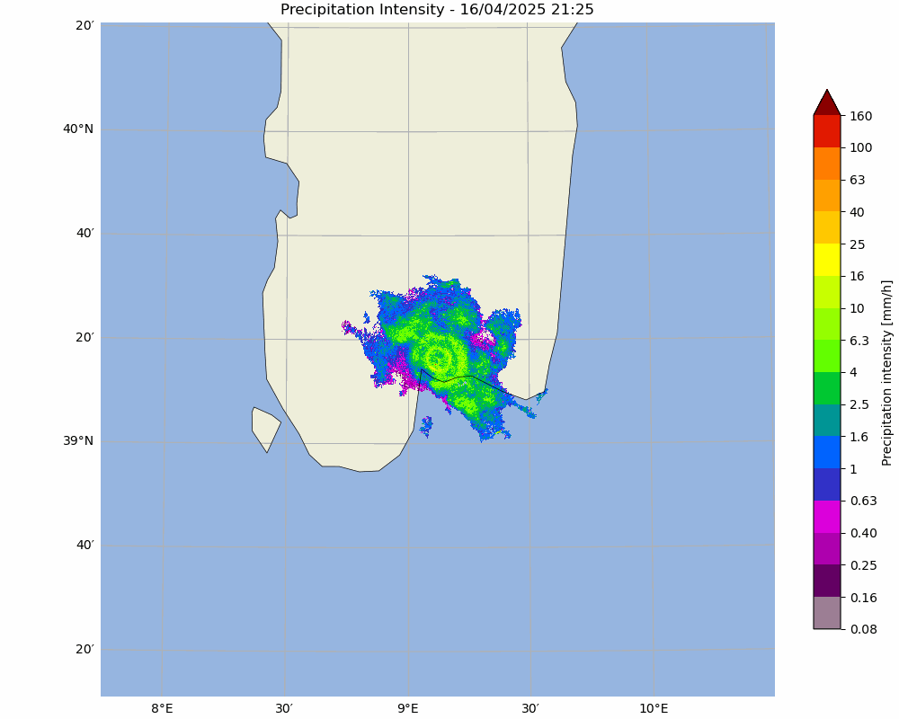
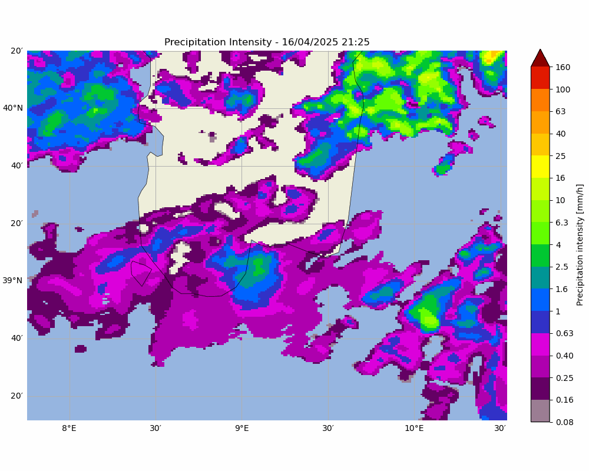

# radar_nowcasting





This repository provides tools and reproducible workflows for precipitation nowcasting using weather radar data collected from multiple sources. The focus is on processing and forecasting with **Single-Polarization X-Band**, **Dual-Polarization X-Band**, and **C-Band** radar data, utilizing the open-source Python framework **[Pysteps](https://pysteps.github.io/)** (Probabilistic Short-Term Ensemble Prediction System).

Data originates from a network of radars managed by **University of Cagliari**, covering:
- **30 km** radius of the Cagliari metropolitan area (X-Band, Single Pol.) with a spatial resolution of 60 meters.
- **120 km** radius across Southern Sardinia (X-Band, Dual Pol.) with a spatial resolution of 250 meters.
- **National Italian Radar Network** (C-Band) provided by the Italian Civil Protection agency, cropped to Southern Sardinia with a spatial resolution of 1 km.

## Core Methodologies

This repository implements a suite of techniques for radar data processing and nowcasting:

### Motion Estimation
- Lucas-Kanade (LK)
- Variational Echo Tracking (VET)
- Dynamic and Adaptive Radar Tracking of Storms (DARTS)
- Anisotropic Diffusion (Proesmans et al., 1994)

### Nowcasting Schemes
- Extrapolation (Eulerian and Semi-Lagrangian)
- Deterministic Forecasting with S-PROG [A.W.Seed, 2003](https://journals.ametsoc.org/view/journals/apme/42/3/1520-0450_2003_042_0381_adassa_2.0.co_2.xml)
- ANVIL Forecasting [Pulkkinen et al., 2020](https://ieeexplore.ieee.org/document/9068498)
- Probabilistic Nowcasting using STEPS [Bowler et al., 2006](https://rmets.onlinelibrary.wiley.com/doi/abs/10.1256/qj.04.100)

### Verification Metrics
- Mean Absolute Error (MAE)
- Critical Success Index (CSI)
- Probability of Detection (POD)
- False Alarm Ratio (FAR)
- Fractional Skill Score (FSS)

Additionally, the repository includes analysis of **Power Spectral Density (PSD)** to examine the spectral properties of precipitation fields and forecasts.

This repository contains code and resources for radar-based precipitation nowcasting. Follow the steps below to clone the repository and set up the required environment on your local system.

---

## Table of Contents
1. [Prerequisites](#prerequisites)
2. [Installation](#installation)
3. [Setting Up the Environment](#setting-up-the-environment)
4. [Usage](#usage)
5. [Sample Data](#sample-data)
6. [Contributing](#contributing)
7. [Funding](#funding)
8. [References](#references)

---

## Prerequisites

Before you begin, ensure you have the following installed on your system:

- **Git**: [Download and install Git](https://git-scm.com/downloads).
- **Anaconda/Miniconda**: [Download and install Anaconda](https://www.anaconda.com/products/distribution) or [Miniconda](https://docs.conda.io/en/latest/miniconda.html).

---

## Installation

### Step 1: Clone the Repository
To clone this repository to your local directory, open a terminal and run the following command:
```bash
git clone https://github.com/AVI68/radar_nowcasting.git
```


### Step 2: Navigate to the Repository
Change the directory to the cloned repository:
```bash
cd radar_nowcasting
```

## Setting Up the Environment

### Step 1: Create the Conda Environment
The environment.yml file is provided in the repository to create a Conda environment with all the necessary dependencies. Run the following command to create the environment:
```bash
conda env create -f environment.yml
```

### Step 2: Activate the Environment
Activate the newly created environment:

```bash
conda activate radar_nowcasting_env
```

## Usage

### Step 3: Run the Jupyter Notebook
Run the provided Jupyter Notebook to reproduce the results:
```bash
jupyter notebook
```

## Data Structure
The repository includes a Data directory containing radar datasets from various sources, used to run the notebooks for precipitation nowcasting analysis. Each dataset corresponds to a specific radar system with its own folder structure. The notebook is configured to automatically load data from this directory. Make sure the Data directory is in the root of the repository after cloning. 
```bash
Data/
├── Data_UNICA_SG/                       # X-Band radar from UNICA (extracted eventwise)
│   └── yyyymmdd_HHMM/
│       └── *.png
│
├── Data_Civil_Protection/              # National Radar Network (C-Band)
│   ├── geodata/
│   │   └── *.tif                       # Geographic base data
│   └── VMI/
│       └── yyyy/mm/dd/
│           └── VMI_<timestamp>.h5
│
├── Data_perser/                        # Perser X-Band radar (CZW & OZW)
│   ├── CZW/
│   │   └── CZW<station_id>/
│   │       └── *.h5
│   └── OZW/
│       └── OZW<station_id>/
│           └── *.h5
│
├── Data_gavino/                        # Single Pol. X-Band radar
│   ├── data/
│   │   └── yyyy/mm/dd/
│   │       └── *.png
│   └── geodata/
│       └── radarmappatipo.tif

```
## Data Description

### UNICA_SG
- **Radar Type**: Single-Polarization X-Band  
- **Source**: DICAAR, University of Cagliari  
- **Structure**:  
  - Subfolders (refers to events) follow timestamp format: `yyyymmdd_HHMM`  
  - Each subfolder contains `.png` reflectivity images

### Data_Civil_Protection
- **Radar Type**: National Radar Network (C-Band)  
- **Source**: Italian Civil Protection agency  
- **Structure**:  
  - File path format: `Data_Civil_Protection/VMI/yyyy/mm/dd/VMI_<timestamp>.h5`  
  - Geographic base map stored in: `Data_Civil_Protection/geodata/`

### Data_perser
- **Radar Type**: Dual-Polarization X-Band  
- **Source**: DICAAR, University of Cagliari 
- **Structure**:  
  - File naming convention:
    - `CZW<date information><timestamp>L.805.h5`  
    - `OZW<date information><timestamp>L.810.h5`
- CZW and OZW are two radar products representing Vertical Maximum Intensity (VMI) and Constant Altitude Plan Position Indication (CAPPI), respectively. 

### Data_gavino
- **Radar Type**: Single-Polarization X-Band  
- **Source**: DICAAR, University of Cagliari  
- **Structure**:  
  - Image data path: `data/yyyy/mm/dd/yyyymmdd_HHMM.png`  
  - Geographic base map: `geodata/radarmappatipo.tif`
---

## Usage Notes

- Each radar dataset is processed using a dedicated Jupyter Notebook.
- All datasets are harmonized internally to ensure compatibility with **Pysteps**.
- Maintain the described folder structure to prevent data path issues during execution.

---

## Data Sources

- **UNICA_SG** and **Gavino** radar data: Provided by Envisens Technologies s.r.l., managed by DICAAR, UNICA. You can also view real-time radar scans updated every minute here [Meteo Radar – UnicaWATER](https://meteoradar.unica.it/).
- **Civil Protection** radar data: available from [Italian Civil Protection agency portal](https://mappe.protezionecivile.gov.it/en/risks-maps-and-dashboards/radar-map/).
- **Perser**  radar data: Provided by  s.r.l., managed by DICAAR, UNICA 


## Contributing

Created by Meteo Radar, UnicaWATER, Hydraulic Division, Department of Civil, Environmental and Architectural Engineering, University of Cagliari.


### Working Team:
- **Avijit Majhi** (majhiavijit1996@gmail.com)
- **Alessandro Seoni** (aseoni@unica.it)
- **Maria Grazia Badas** (mgbadas@unica.it)
- **Francesco Viola** (hydroviolante@gmail.com)
- **Roberto Deidda** (rdeidda@unica.it)

Contributions are welcome! Feel free to fork this repository, make your changes, and submit a pull request.

## Funding

Developed under the GeoSciences IR, WP4, UNICA 03 - Risk monitoring and management project funded by NRRP, European Union – NextGenerationEU.

- **Title of the Project: Precipitation ensemble nowcasting procedures** 
- **Ministerial Code: IR0000037**
- **CUP: I53C22000800006**
- **Principal Investigator: Prof. Roberto Deidda**

## Reference publications
Pulkkinen, S., D. Nerini, A. Perez Hortal, C. Velasco-Forero, U. Germann, A. Seed, and L. Foresti, 2019: Pysteps: an open-source Python library for probabilistic precipitation nowcasting (v1.0). Geosci. Model Dev., 12 (10), 4185–4219, doi:10.5194/gmd-12-4185-2019, https://gmd.copernicus.org/articles/12/4185/2019/